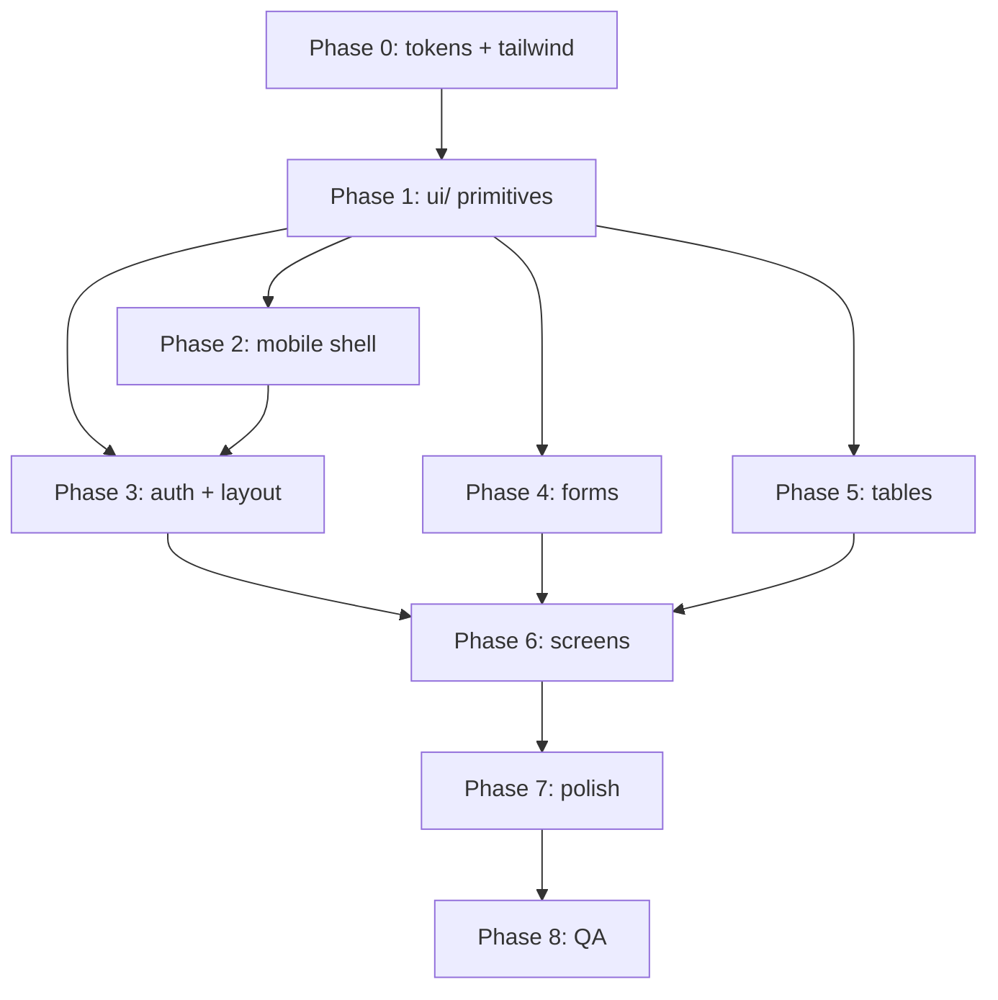

# Дорожная карта редизайна CRM — Frontend

> **Версия документа:** 1.0  
> **Дата:** 7 июня 2026  
> **Область:** только клиентская часть (`client/`)  
> **Статус:** Phase 0–8 выполнены — редизайн завершён

---

## Progress

| Фаза | Статус |
|------|--------|
| Phase 0 — Подготовка | ✅ |
| Phase 1 — UI-примитивы | ✅ |
| Phase 2 — Mobile shell | ✅ |
| Phase 3 — Auth + Layout | ✅ |
| Phase 4 — Консолидация форм | ✅ |
| Phase 5 — Таблицы и списки | ✅ |
| Phase 6 — Ключевые экраны | ✅ |
| Phase 7 — Полировка | ✅ |
| Phase 8 — QA и регрессия | ✅ |

---

## Implementation Complete

Редизайн фронтенда CRM завершён (июнь 2026). Краткая сводка:

| Область | Результат |
|---------|-----------|
| **Дизайн-система** | `theme/tokens.ts`, `statusColors.ts`, `utils/format.ts`, `DESIGN.md`; брендовые токены в Tailwind |
| **UI-примитивы** | `components/ui/` — Button, Input, FormField, Modal, Table, DataTable, Badge, Card, Spinner, Alert, Toast, ConfirmDialog, Pagination и др. |
| **Mobile shell** | Drawer sidebar `< md`, hamburger в Layout, `marginLeft: 0` на mobile, fullscreen modals, touch targets ≥ 44px |
| **Auth + Layout** | Login/Register в бренде, sidebar `brand-black` / активный `brand-yellow`, OrderDraftBanner адаптивный |
| **Формы** | UnifiedSupplierForm, ProductFormFields, OrderLineItemsEditor, ProductListItem; мёртвый код удалён |
| **Таблицы** | DataTable + mobile card view (Orders), единая Pagination |
| **Экраны** | 16 маршрутов в бренде; split-layouts адаптивны на Products/Suppliers |
| **Полировка** | `window.confirm` → ConfirmDialog, `alert` → toast, formatPrice/formatDate централизованы |
| **Модалки** | Большинство `*Modal.tsx` на `ui/Modal`; осталось 7 legacy-оболочек (см. Phase 8 QA) |

Ручная проверка — см. `QA_CHECKLIST.md`.

---

## Назначение документа

Этот документ — единый план поэтапного редизайна и рефакторинга UI фронтенда CRM-системы управления товарами, поставщиками и заявками. Он синтезирует выводы четырёх завершённых аудитов (архитектура, стилизация, компоненты, адаптивность) и превращает их в конкретные фазы работ с чеклистами, приоритетами и примерами промптов.

**Цель:** привести интерфейс к единому фирменному стилю (жёлтый / чёрный / белый), устранить дублирование, обеспечить мобильную готовность и заложить масштабируемую архитектуру UI-примитивов — **без изменения бизнес-логики и API-контрактов**.

**Вне скоупа:** бэкенд, миграция с CRA на Vite/Next.js, изменение схемы БД, новые фичи (кроме UI-инфраструктуры: toast, ConfirmDialog).

---

## Текущее состояние (сводка по аудитам)

### Архитектура

| Аспект | Состояние |
|--------|-----------|
| Стек | React 19 + Create React App + TypeScript + Tailwind CSS 3 |
| Маршрутизация | 16 маршрутов в `App.tsx` (auth, dashboard, orders, products, suppliers, price-list, map, stock, categories, collector, warehouse, users) |
| Состояние | React Context (`AuthContext`, `UIContext`, `OrderDraftContext`) — без Redux/Zustand |
| Дизайн-система | **Отсутствует** — нет `components/ui/`, нет токенов, нет единого theme |
| Структура | `pages/` (экраны), `components/` (33+ компонента), `hooks/`, `services/`, `utils/`, `context/` |
| Иконки | `lucide-react` — единообразно |
| Формы | `@tailwindcss/forms`, `react-select` — точечно |

### Стилизация

- **Подход:** utility-first Tailwind, классы инлайн в JSX.
- **Фирменные цвета** (`#FBBF24`, `#111111`, `#FFFFFF`) заданы только в `utils/pdfGenerator.ts` и частично на `PriceListPage` — **~40% покрытия бренда**.
- **Основной UI** — типичная blue-gray SaaS-палитра: `bg-gray-50`, `bg-blue-600`, `text-gray-700`, sidebar `bg-gray-900`.
- **Tailwind config:** расширен только `primary` (синий `#2563eb`), брендовые токены не вынесены.
- **Типографика:** системный sans-serif, единого scale нет.
- **Тени и скругления:** ad-hoc (`rounded-lg`, `shadow-lg`) без токенов.

### Компоненты

| Метрика | Значение |
|---------|----------|
| Компоненты в `components/` | ~33 уникальных файла |
| Модальные окна | 20+ (`*Modal.tsx`) |
| Оболочка модалки | Скопирована в каждом файле: `fixed inset-0 bg-black/50 z-50` + белая карточка |
| Формы поставщиков | 3 варианта: `UnifiedSupplierForm`, `EditSupplierModal`, `CreateSupplierModal` (мёртвый код) |
| Дублирование | Create/Edit Product, Create/Edit Order (~800+ строк пересечения), списки товаров в 4+ местах |
| Мёртвый код | `App.css` (не импортируется), `CreateSupplierModal`, `GlobalOrderDraft`, `SectorManager` |

### Адаптивность

- **Desktop-first:** sidebar фиксированной ширины 256px (80px в collapsed), `marginLeft` в `Layout.tsx`.
- **Мобильная готовность:** низкая — нет drawer, нет hamburger, sidebar перекрывает контент на `< md`.
- **Split-layouts** (`ProductsPage`, `SuppliersPage`, `SupplierDetailsPage`) без breakpoint-переключения.
- **Таблицы:** горизонтальный скролл или обрезка на 375px.
- **Touch targets:** кнопки `py-2` (~32px) — ниже рекомендуемых 44px.
- **Модалки:** `max-w-*` по центру — на мобильных узкие, не fullscreen.
- **Сломанные маршруты:** `/settings`, `/profile` в sidebar — маршрутов в `App.tsx` нет.

---

## Принципы дизайна

1. **Минимализм** — чистые поверхности, воздух, один акцентный CTA на экран. Без декоративного шума.
2. **Консистентность бренда** — жёлтый / чёрный / белый как primary; синий — вторичный акцент и ссылки.
3. **UX-first** — понятные состояния (loading, empty, error), предсказуемая навигация, touch-friendly на мобильных.
4. **DRY** — один `Modal`, один `Button`, одна форма поставщика. Дублирование = техдолг.
5. **Mobile-first migration** — сначала shell (drawer, header), затем экраны. Breakpoints: `sm` 640, `md` 768, `lg` 1024, `xl` 1280.
6. **Не ломать бизнес-логику** — рефакторинг только presentation layer. Хуки (`useProductEditor`, `OrderDraftContext`), API-слой и типы не трогать без необходимости.

---

## Бренд и цветовая система

**Источник истины:** `src/utils/pdfGenerator.ts` → константа `BRAND`.

### Брендовые токены

| Токен | HEX | Назначение |
|-------|-----|------------|
| `brand-yellow` | `#FBBF24` | Primary CTA, активный пункт меню, акценты |
| `brand-yellow-dark` | `#D97706` | Hover CTA, предупреждения |
| `brand-black` | `#111111` | Sidebar, заголовки, текст на жёлтом |
| `brand-white` | `#FFFFFF` | Фон карточек, текст на тёмном |
| `text-muted` | `#4B5563` | Вторичный текст |
| `border` | `#E5E7EB` | Разделители, рамки |
| `zebra` | `#FAFAFA` | Чередование строк таблиц |

### Вторичные и семантические

| Токен | HEX | Назначение |
|-------|-----|------------|
| `accent-blue` | `#2563eb` | Ссылки, info, вторичные кнопки |
| `success` | `#16a34a` | Статус «выполнено», подтверждено |
| `warning` | `#D97706` | Ожидание, частичное подтверждение |
| `danger` | `#dc2626` | Удаление, ошибки, просрочено |
| `info` | `#2563eb` | Информационные бейджи |

### Правила применения

- **Primary CTA:** `bg-brand-yellow text-brand-black font-semibold hover:bg-brand-yellow-dark`
- **Secondary CTA:** `border border-gray-300 text-gray-700 hover:bg-gray-50`
- **Destructive:** `bg-danger text-white` или outline + red
- **Sidebar:** фон `brand-black`, активный пункт `brand-yellow` + `brand-black` текст
- **Не смешивать** `bg-blue-600` с primary CTA — синий только для ссылок и info

---

## Целевая архитектура

```
client/src/
├── theme/
│   ├── tokens.ts          # Цвета, spacing, radii, shadows, typography
│   └── statusColors.ts    # Маппинг статусов заявок/товаров → цвета бейджей
├── components/
│   └── ui/                # Примитивы (единственный источник UI-паттернов)
│       ├── Button.tsx
│       ├── Input.tsx
│       ├── FormField.tsx
│       ├── FormFooter.tsx
│       ├── Modal.tsx
│       ├── Spinner.tsx
│       ├── Alert.tsx
│       ├── EmptyState.tsx
│       ├── ErrorState.tsx
│       ├── Badge.tsx
│       ├── Card.tsx
│       ├── IconButton.tsx
│       ├── Table.tsx
│       ├── DataTable.tsx
│       ├── ConfirmDialog.tsx
│       ├── Toast.tsx          # или react-hot-toast wrapper
│       └── Pagination.tsx     # расширенный, из текущего Pagination.tsx
├── utils/
│   └── format.ts          # formatPrice, formatDate, formatPhone
└── DESIGN.md              # Краткий style guide для разработчиков
```

### Зависимости между слоями



---

## Дорожная карта: 8 фаз

### Phase 0 — Подготовка

**Цель:** заложить фундамент токенов и убрать мёртвый код.

#### Задачи

- [ ] Создать `src/theme/tokens.ts` — экспорт всех цветов, spacing, radii из раздела «Бренд».
- [ ] Создать `src/DESIGN.md` — краткий style guide (цвета, кнопки, типографика, примеры классов).
- [ ] Обновить `tailwind.config.js`:
  - Добавить `brand-yellow`, `brand-black`, `brand-white`, `accent-blue`, semantic colors.
  - Сохранить `primary` как alias к `accent-blue` для обратной совместимости на переходный период.
- [ ] Удалить мёртвый код:
  - [ ] `src/App.css` — не импортируется нигде.
  - [ ] `src/components/CreateSupplierModal.tsx` — нигде не импортируется.
  - [ ] `src/components/GlobalOrderDraft.tsx` — заменён на `OrderDraftBanner`.
  - [ ] `src/components/SectorManager.tsx` — не используется в маршрутах.
- [ ] Добавить `src/theme/statusColors.ts` — заготовка с типами статусов из `types/index.ts`.
- [ ] Добавить `src/utils/format.ts` — заготовки `formatPrice`, `formatDate` (перенос из pdfGenerator позже).

**Файлы:** `tailwind.config.js`, `theme/tokens.ts`, `theme/statusColors.ts`, `utils/format.ts`, `DESIGN.md`

**Критерий готовности:** `npm run build` без ошибок; брендовые классы доступны в Tailwind (`bg-brand-yellow`).

---

### Phase 1 — UI-примитивы (`components/ui/`)

**Цель:** единая библиотека компонентов, на которую пересядут все модалки и формы.

#### Компоненты

| Компонент | Props / поведение |
|-----------|-------------------|
| `Button` | `variant`: primary \| secondary \| danger \| ghost; `size`: sm \| md \| lg; `loading`, `disabled`, `icon` |
| `Input` | label, error, hint, `type`, forwardRef |
| `FormField` | label + Input/Textarea/Select + error message |
| `FormFooter` | Cancel + Submit, выравнивание right, gap-3 |
| `Modal` | `isOpen`, `onClose`, `title`, `size`: sm \| md \| lg \| full; overlay click; Escape; mobile fullscreen при `full` |
| `Spinner` | sizes sm/md/lg, `brand-yellow` border |
| `Alert` | `variant`: info \| success \| warning \| error; иконка + текст |
| `EmptyState` | иконка, заголовок, описание, optional CTA |
| `ErrorState` | сообщение + кнопка «Повторить» |
| `Badge` | `variant` по statusColors |
| `Card` | header, body, footer slots |
| `IconButton` | круглая, `aria-label`, min 44×44 на mobile |
| `Pagination` | перенос и расширение текущего `Pagination.tsx` + ui-стили |

#### Задачи

- [ ] Создать все компоненты с TypeScript props и Tailwind на токенах.
- [ ] `Modal` — единая оболочка: overlay `bg-black/50`, `z-50`, анимация fade, focus trap (базовый).
- [ ] `Button` primary = `brand-yellow` + `brand-black` текст.
- [ ] Storybook **не обязателен** — достаточно примеров в `DESIGN.md`.
- [ ] Написать один «пилотный» рефакторинг: перевести `DeleteConfirmModal` на `Modal` + `Button` (как эталон).

**Критерий готовности:** `DeleteConfirmModal` использует ui-примитивы; остальные компоненты не трогаем.

---

### Phase 2 — Mobile shell (P0)

**Цель:** приложение usable на 375px без горизонтального скролла от sidebar.

#### Задачи

- [ ] **`UIContext.tsx`:** добавить `isMobileSidebarOpen`, `openMobileSidebar`, `closeMobileSidebar`; опционально `isMobile` через `matchMedia('(max-width: 767px)')`.
- [ ] **`Sidebar.tsx`:**
  - [ ] `< md`: скрыт по умолчанию, открывается как drawer overlay слева.
  - [ ] `≥ md`: текущее поведение (fixed, 256/80px).
  - [ ] Backdrop при открытом drawer — клик закрывает.
  - [ ] Активный пункт: `bg-brand-yellow text-brand-black` (подготовка к Phase 3).
- [ ] **`Layout.tsx`:**
  - [ ] `< md`: `marginLeft: 0`.
  - [ ] Mobile header: hamburger (Menu icon), заголовок страницы, опционально поиск.
  - [ ] `min-h-11` (44px) для интерактивных элементов header.
- [ ] **Модалки (глобальное правило):** в `Modal` — `max-md:fixed max-md:inset-0 max-md:rounded-none max-md:max-w-none`.
- [ ] Проверить `OrderDraftBanner` — не перекрывает header на mobile.

**Файлы:** `Layout.tsx`, `Sidebar.tsx`, `UIContext.tsx`, `components/ui/Modal.tsx`

**Критерий готовности:** на 375px sidebar не занимает место; hamburger открывает drawer; все 16 маршрутов открываются.

---

### Phase 3 — Auth + Layout polish

**Цель:** первое впечатление и навигация в бренде.

#### Задачи

- [ ] **`Login.tsx` / `Register.tsx`:**
  - [ ] Фон `brand-white` / лёгкий `zebra`.
  - [ ] Логотип/иконка: `brand-yellow` круг + `brand-black` иконка.
  - [ ] Primary submit = `Button` primary.
  - [ ] Убрать `bg-blue-600` с auth-экранов.
- [ ] **`Sidebar.tsx`:**
  - [ ] Фон `brand-black`.
  - [ ] Активный пункт: `brand-yellow` / `brand-black`.
  - [ ] Hover: `bg-white/10`.
  - [ ] Аватар: `brand-yellow` border или фон.
- [ ] **`OrderDraftBanner.tsx`:** адаптивная вёрстка (stack на mobile), кнопки ui/Button.
- [ ] **Toast-система:**
  - [ ] Добавить `components/ui/Toast.tsx` или обёртку над `react-hot-toast`.
  - [ ] `utils/toast.ts` — `toast.success()`, `toast.error()`.
  - [ ] Заменить `alert()` **только на 2–3 пилотных экранах** (Orders, OrderDetails) — полная замена в Phase 7.
- [ ] Исправить пункты меню `/settings` и `/profile`: скрыть или заглушка «Скоро» до реализации страниц.

**Критерий готовности:** auth и sidebar в бренде; toast работает на пилотных экранах; mobile banner не ломает layout.

---

### Phase 4 — Консолидация форм

**Цель:** убрать главные очаги дублирования (~1500+ строк).

#### 4.1 Формы поставщиков

- [ ] Расширить `UnifiedSupplierForm` — режимы `create` | `edit`.
- [ ] Перенести логику из `EditSupplierModal` в `UnifiedSupplierForm`.
- [ ] Удалить `EditSupplierModal.tsx`; обновить импорты в `SupplierCards.tsx`.
- [ ] Убедиться, что `CreateSupplierModal.tsx` удалён (Phase 0).
- [ ] Обёртка: `SupplierFormModal` на базе `ui/Modal` (опционально).

#### 4.2 Формы товаров

- [ ] Создать `ProductFormFields.tsx` — общие поля (название, категория, единица, фото, описание).
- [ ] `CreateProductModal` + `EditProductModal` → тонкие оболочки над `ProductFormFields` + `useProductEditor`.
- [ ] Перевести оболочки на `ui/Modal`, `FormFooter`, `FormField`.

#### 4.3 Формы заявок

- [ ] Создать `OrderLineItemsEditor.tsx` — таблица/список позиций, добавление вариаций, итоги.
- [ ] `CreateOrderModal` + `EditOrderModal` → shared editor + разная логика submit.
- [ ] Общий поиск товара / выбор вариации вынести в подкомпонент.

#### 4.4 Списки товаров

- [ ] Создать `ProductListItem.tsx` — карточка/строка товара (фото, название, цена, действия).
- [ ] Использовать в `ProductList`, `SupplierProductCatalog`, `SupplierProductsPanel`, модалках заявок.

**Критерий готовности:** нет дублирования полей поставщика; Create/Edit Product и Order используют shared-компоненты; `npm run build` OK.

---

### Phase 5 — Таблицы и списки

**Цель:** единообразные data views + mobile card fallback.

#### Задачи

- [ ] Создать `ui/Table.tsx` — `Table`, `TableHead`, `TableBody`, `TableRow`, `TableCell`; zebra, hover.
- [ ] Создать `ui/DataTable.tsx` — columns config, sorting (если есть), pagination slot, `emptyState`.
- [ ] **`Orders.tsx`:**
  - [ ] `≥ md`: таблица через `DataTable`.
  - [ ] `< md`: card view (номер, статус Badge, сумма, дата, tap → details).
- [ ] Унифицировать пагинацию — везде `ui/Pagination`.
- [ ] `ProductsPage`, `SuppliersPage`, `Users.tsx` — перевести на `DataTable` или `Table`.
- [ ] Sticky header таблиц на desktop.

**Критерий готовности:** Orders читаемы на 375px (карточки); пагинация единообразна на 3+ экранах.

---

### Phase 6 — Ключевые экраны

**Цель:** бренд и ui-примитивы на всех основных маршрутах. Подфазы независимы — можно отдельными промптами.

#### 6.1 Dashboard

- [ ] Карточки метрик — `ui/Card`, акцент `brand-yellow` на ключевой цифре.
- [ ] Сетка: `grid-cols-1 sm:grid-cols-2 lg:grid-cols-4`.
- [ ] Loading → `Spinner`; пустые виджеты → `EmptyState`.

#### 6.2 Orders + OrderDetails

- [ ] Список — из Phase 5.
- [ ] `OrderDetails.tsx`: header с Badge статуса (`statusColors`), action bar (responsive wrap).
- [ ] Кнопки PDF / WhatsApp — `Button` secondary; primary CTA — жёлтый.
- [ ] Timeline / статусы — единые Badge.
- [ ] Все модалки OrderDetails на `ui/Modal`.

#### 6.3 Products + Suppliers

- [ ] `ProductsPage` / `SuppliersPage`: split layout → `≥ lg` две колонки, `< lg` tabs или stack.
- [ ] `SupplierCards` — Card grid, мобильная 1 колонка.
- [ ] Фильтры — collapsible panel на mobile.

#### 6.4 PriceListPage

- [ ] Уже ближе к бренду — привести к токенам (`brand-yellow` header, `brand-black` текст).
- [ ] Кнопка PDF — primary yellow.
- [ ] Печатная вёрстка — не сломать.

#### 6.5 SupplierDetailsPage

- [ ] Табы или sections: каталог, финансы, заявки.
- [ ] `SupplierProductCatalog` + `SupplierProductsPanel` — стили ui, не менять логику хуков.
- [ ] Mobile: stack вместо side-by-side.

#### 6.6 Stock / Categories / Users

- [ ] `StockDashboard`, `Categories`, `Users` — Table/DataTable, EmptyState, ErrorState.
- [ ] Admin-формы на `FormField` + `Button`.

#### 6.7 Map / Collector / Warehouse

- [ ] `MapPage` + `BaysideMap` — fullHeight layout, кнопки ui.
- [ ] `CollectorTasks`, `WarehouseReceipt` — mobile-friendly формы приёмки, крупные touch targets.
- [ ] `RowManager`, `MarketManagementModal` — ui/Modal.

**Критерий готовности:** каждый подэкран визуально в бренде; split-layouts адаптивны.

---

### Phase 7 — Полировка

**Цель:** UX-детали и устранение острых углов.

#### Задачи

- [ ] **`ConfirmDialog`** на базе `Modal` — заменить все `window.confirm()` (~15 мест).
- [ ] **Полная замена `alert()`** на toast (~40+ вызовов) — см. grep-аудит.
- [ ] **`format.ts`:** `formatPrice(ru-RU, ₽)`, `formatDate`, `formatPhone` — использовать везде вместо inline.
- [ ] **`statusColors.ts`:** единый маппинг для заявок, оплат, сборки.
- [ ] **iOS safe area:** `pb-safe`, `env(safe-area-inset-*)` на mobile header и drawer.
- [ ] **Маршруты `/settings`, `/profile`:** страницы-заглушки или удаление пунктов меню.
- [ ] **Focus styles:** `focus-visible:ring-2 ring-brand-yellow` на интерактивных элементах.
- [ ] **Переход модалок:** оставшиеся 18 модалок на `ui/Modal`.

**Модалки для миграции (чеклист):**

- [ ] CategoryModal
- [ ] ChangeOrderStatusModal
- [ ] CreateOrderModal
- [ ] CreateProductModal
- [ ] EditOrderModal
- [ ] EditProductModal
- [ ] LinkProductToSupplierModal
- [ ] MarketManagementModal
- [ ] PaymentModal
- [ ] PriceHistoryModal
- [ ] ProductSuppliersModal
- [ ] ProductVariationsModal
- [ ] ReconciliationModal
- [ ] SendProductImageModal
- [ ] SupplierFinanceModal
- [ ] UpdatePricesFromOrderModal
- [ ] UnifiedSupplierForm (оболочка)
- [ ] RowManager

**Критерий готовности:** нет `window.confirm` и `alert` в production-коде; единое форматирование цен.

---

### Phase 8 — QA и регрессия

**Цель:** убедиться, что редизайн не сломал бизнес-процессы.

#### Viewports

| Ширина | Устройство | Приоритет |
|--------|------------|-----------|
| 375px | iPhone SE / mini | P0 |
| 768px | iPad portrait | P1 |
| 1280px | Desktop | P0 |

#### Чеклист маршрутов (16)

- [ ] `/login`, `/register`
- [ ] `/dashboard`
- [ ] `/orders`, `/orders/:id`
- [ ] `/products`
- [ ] `/suppliers`, `/suppliers/:id`
- [ ] `/price-list`
- [ ] `/map`
- [ ] `/stock`
- [ ] `/categories`
- [ ] `/collector/tasks`
- [ ] `/warehouse/receipt`
- [ ] `/users`

#### Регрессия бизнес-флоу

- [ ] Создание заявки (CreateOrderModal + OrderDraft)
- [ ] Черновик заявки: сохранение, восстановление, удаление (OrderDraftContext)
- [ ] Редактирование заявки, смена статуса, оплата
- [ ] PDF заявки (pdfGenerator)
- [ ] WhatsApp-отправка (OrderDetails)
- [ ] Создание/редактирование товара с фото
- [ ] Привязка поставщика к товару
- [ ] Прайс-лист: фильтры + PDF
- [ ] Карта рынка (BaysideMap)
- [ ] Приёмка на складе с расхождениями
- [ ] Создание пользователя (admin)
- [ ] Logout / redirect на login

#### Технический чеклист

- [ ] `npm run build` — без ошибок и warnings по типам.
- [ ] Нет горизонтального скролла на 375px (кроме намеренных таблиц с scroll).
- [ ] Lighthouse Accessibility ≥ 85 на Dashboard (ориентир).
- [ ] Все touch targets ≥ 44px на mobile.

---

## Руководство по промптам

**Правило:** одна фаза (или один подпункт Phase 6) = один отдельный промпт. Не смешивать Phase 4 и Phase 6 в одном запросе.

### Шаблон промпта

```
Контекст: проект crm3/client, дорожная карта DESIGN_ROADMAP.md.
Фаза: [номер и название].
Задача: [конкретные чеклист-пункты].
Ограничения:
- Не менять API и бизнес-логику.
- Использовать ui-примитивы из components/ui/.
- Использовать токены из theme/tokens.ts.
- Сохранить существующие тесты.
Файлы: [явный список].
Критерий готовности: [из roadmap].
```

### Примеры промптов

**Phase 0:**
> Выполни Phase 0 из `client/DESIGN_ROADMAP.md`: создай `theme/tokens.ts`, обнови `tailwind.config.js` брендовыми цветами, создай заготовки `statusColors.ts` и `format.ts`, удали мёртвый код (`App.css`, `CreateSupplierModal`, `GlobalOrderDraft`, `SectorManager`). Не трогай страницы.

**Phase 1:**
> Выполни Phase 1: создай `components/ui/` с Button, Input, FormField, FormFooter, Modal, Spinner, Alert, EmptyState, ErrorState, Badge, Card, IconButton, Pagination. Переведи `DeleteConfirmModal` на ui-примитивы как пилот. Primary кнопка — brand-yellow.

**Phase 2:**
> Выполни Phase 2 (mobile shell): drawer sidebar на `< md`, hamburger в Layout, `marginLeft: 0` на mobile, touch targets min-h-11. Файлы: Layout.tsx, Sidebar.tsx, UIContext.tsx, ui/Modal.tsx (fullscreen on mobile).

**Phase 4.2:**
> Выполни Phase 4.2: создай `ProductFormFields.tsx`, рефактори `CreateProductModal` и `EditProductModal` на shared fields + `useProductEditor`. Оболочки — ui/Modal.

**Phase 6.2:**
> Выполни Phase 6.2: редизайн OrderDetails и Orders в бренде, Badge статусов из statusColors, mobile card view для Orders. Не меняй ordersApi.

**Phase 7:**
> Выполни Phase 7: создай ConfirmDialog, замени все window.confirm. Добавь toast и замени все alert(). Вынеси formatPrice в utils/format.ts.

**Phase 8:**
> Выполни Phase 8 QA: пройди чеклист 16 маршрутов на 375/768/1280px, исправь найденные баги. Отчёт в комментарии к коммиту.

### Рекомендуемый порядок

1. Phase 0 → 1 → 2 → 3 (фундамент + mobile)
2. Phase 4 → 5 (формы и таблицы)
3. Phase 6.1–6.7 (по одному промпту на подфазу)
4. Phase 7 → 8

**Оценка:** ~15–18 промптов на полный цикл.

---

## Риски и митигации

| Риск | Вероятность | Влияние | Митигация |
|------|-------------|---------|-----------|
| Регрессия OrderDraft при рефакторинге модалок | Средняя | Высокое | Не трогать `OrderDraftContext`; тестировать флоу после Phase 4.3 |
| Слом PDF/WhatsApp при смене вёрстки OrderDetails | Низкая | Высокое | pdfGenerator не зависит от React-вёрстки; тест в Phase 8 |
| Scope creep (миграция на Vite, новые фичи) | Высокая | Среднее | Жёсткий скоуп: только UI; новые фичи — отдельные задачи |
| Конфликты Tailwind при переименовании цветов | Средняя | Среднее | Alias `primary` → `accent-blue`; постепенная замена |
| Модалки с вложенным state (ProductSuppliersModal) | Высокая | Среднее | Рефакторить оболочку первой; логику не трогать |
| Mobile drawer + OrderDraftBanner overlap | Средняя | Низкое | Тест на 375px в Phase 2 и 3 |
| 40+ alert() — пропуск вызовов | Средняя | Низкое | `grep alert(` перед Phase 8; CI rule опционально |
| Split-layout на ProductsPage ломает UX | Средняя | Среднее | Tabs-паттерн на `< lg`; user testing |
| CRA без code splitting — большой bundle | Низкая | Низкое | Вне скоупа; lazy load — отдельная задача |

---

## Оценка трудозатрат

| Фаза | Промптов | Сложность | Зависимости |
|------|----------|-----------|-------------|
| Phase 0 — Подготовка | 1 | Низкая | — |
| Phase 1 — UI-примитивы | 1–2 | Высокая | Phase 0 |
| Phase 2 — Mobile shell | 1 | Высокая | Phase 1 |
| Phase 3 — Auth + Layout | 1 | Средняя | Phase 1, 2 |
| Phase 4 — Формы | 2–3 | Высокая | Phase 1 |
| Phase 5 — Таблицы | 1 | Средняя | Phase 1 |
| Phase 6 — Экраны (6.1–6.7) | 7 | Средняя | Phase 3–5 |
| Phase 7 — Полировка | 1–2 | Средняя | Phase 6 |
| Phase 8 — QA | 1 | Средняя | Phase 7 |
| **Итого** | **~15–18** | | |

---

## Матрица приоритетов

| Приоритет | Элемент | Фаза | Обоснование |
|-----------|---------|------|-------------|
| **P0** | Mobile shell (drawer, header) | 2 | Без этого CRM неюзабелен на телефоне |
| **P0** | ui/Modal (единая оболочка) | 1 | 20+ копий — главный техдолг |
| **P0** | Токены + tailwind brand colors | 0 | Блокер для визуальной консистентности |
| **P1** | Supplier forms merge | 4.1 | 3 формы, риск рассинхрона полей |
| **P1** | Order Create/Edit merge | 4.3 | ~800 строк дублирования |
| **P1** | Orders mobile card view | 5 | Ключевой ежедневный экран |
| **P1** | alert → toast, confirm → ConfirmDialog | 3, 7 | UX и профессионализм |
| **P1** | Sidebar brand styling | 3 | Видно на каждом экране |
| **P2** | Product Create/Edit merge | 4.2 | Дублирование, но изолированно |
| **P2** | ProductListItem shared | 4.4 | 4 места, средний выигрыш |
| **P2** | DataTable abstraction | 5 | Улучшает DX, не блокер |
| **P2** | /settings, /profile routes | 7 | Сломанные ссылки, низкий трафик |
| **P2** | iOS safe area | 7 | Нишевый, но важен для Safari |
| **P2** | Stock/Map/Warehouse polish | 6.6, 6.7 | Реже используемые экраны |

---

## Что уже хорошо — не ломать

Следующие части кодовой базы спроектированы удачно; при редизайне **менять только стили**, не архитектуру:

| Модуль | Почему сохранить |
|--------|------------------|
| `SupplierProductCatalog.tsx` | Чистое разделение каталога и действий; хорошая композиция |
| `useProductEditor.tsx` | Централизованная логика create/edit товара |
| `useSupplierProducts.ts` | Инкапсуляция загрузки товаров поставщика |
| `useSupplierProductActions.tsx` | Действия без UI-耦合 |
| `DeleteConfirmModal.tsx` | Правильный паттерн confirm (перевести на ui/, логику сохранить) |
| `Pagination.tsx` | Уже с mobile/desktop вариантами — расширить, не переписывать |
| `OrderDraftContext.tsx` + `OrderDraftBanner.tsx` | Критичный бизнес-флоу черновиков |
| `orderDraftStorage.ts` | Персистентность черновика |
| `pdfGenerator.ts` | Источник бренда и PDF-логики |
| `ProtectedRoute.tsx` | Auth guard |
| `services/*Api.ts` | API-слой — не трогать |
| `types/index.ts` | Общие типы |
| `BaysideMap.tsx` | Изолированная карта — только стили кнопок |

---

## Ссылки на аудиты

Документ основан на четырёх завершённых аудитах фронтенда:

| Аудит | Фокус | Ключевые выводы |
|-------|-------|-----------------|
| **Архитектура** | Структура, стек, state | CRA, 16 routes, Context, нет design system |
| **Стилизация** | Tailwind, цвета, бренд | Blue-gray SaaS, бренд ~40%, pdfGenerator как эталон |
| **Компоненты** | Модалки, формы, DRY | 33 компонента, 20+ модалок, 3 supplier forms, hotspots |
| **Адаптивность** | Mobile, sidebar, tables | Desktop-first, 256px sidebar, нет drawer, split без breakpoints |

---

## Быстрый старт

1. Прочитай этот документ целиком.
2. Начни с **Phase 0** одним промптом.
3. После каждой фазы — `npm run build` и smoke-test Dashboard + Orders.
4. Не переходи к Phase 6, пока не готовы Phase 1–3.
5. Веди чеклисты в этом файле (отмечай `[x]` по мере выполнения).

---

*Документ живой: обновляй статусы чеклистов и версию по мере прохождения фаз.*
