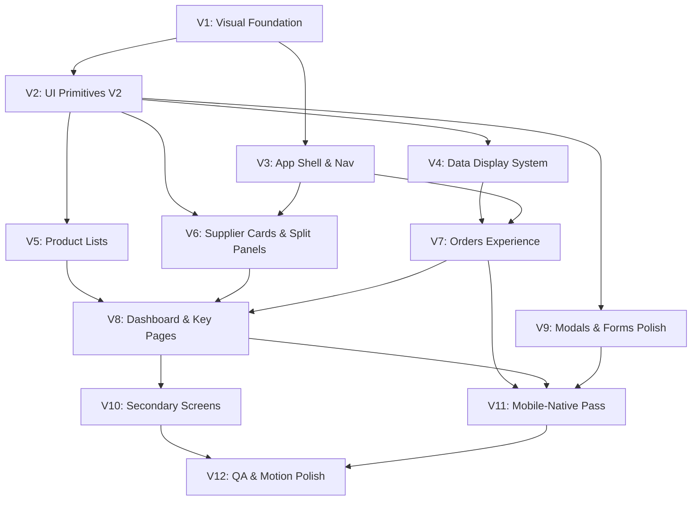

# Visual Redesign Roadmap — Plastkrep CRM

> **Версия:** 2.0 (Visual Transformation)  
> **Дата:** 7 июня 2026  
> **Область:** только presentation layer (`client/`)  
> **Статус:** Visual V2 завершён (V1–V12 ✅) — см. `VISUAL_QA_CHECKLIST.md`

---

## Зачем этот документ

Предыдущий цикл (Phase 0–8, см. `DESIGN_ROADMAP.md`) решил **инфраструктурные** задачи: токены, `components/ui/`, drawer sidebar, консолидация форм. Визуально CRM **по-прежнему выглядит как generic admin-dashboard**:

| Проблема | Где видно сейчас |
|----------|------------------|
| Серые карточки без характера | `Orders.tsx` stat cards, `Card.tsx`, `.card` в `SupplierCards` |
| Слабая типографическая иерархия | `text-gray-900` / `text-gray-600` везде, системный шрифт |
| Rainbow-статистика вне бренда | 8 stat-карточек с `border-blue-400`, `text-purple-600` и т.д. |
| Selected state не в бренде | `ProductListItem`: `bg-blue-50 border-blue-500` |
| Split-панели утилитарны | `Dashboard.tsx`: два одинаковых `Card` с `bg-surface-muted` header |
| Таблицы = raw HTML admin | `Table.tsx`: zebra + divide-y, без editorial feel |
| Mobile = ужатый desktop | stack колонок, нет card-first flows, нет sticky action bars |
| Нет «product feel» | нет единого визуального языка поверхностей, motion, density |

**Этот roadmap — не миграция токенов.** Это полноценный **визуальный продуктовый редизайн**: современный, минималистичный, отличный UX на desktop и mobile. Бизнес-логика, хуки, API, типы — **не трогаем**.

**Справочник для имплементаторов:** [`src/DESIGN_V2.md`](./src/DESIGN_V2.md)

---

## Принципы Visual V2

1. **Продукт, не админка** — интерфейс как у современного B2B SaaS (Linear, Notion, Stripe Dashboard), а не Bootstrap-таблица.
2. **Бренд Plastkrep CRM** — белый фон, чёрный текст, жёлтый `#FBBF24` только для primary actions и ключевых акцентов, синий `#2563eb` — ссылки и вторичная интерактивность.
3. **Типографика несёт иерархию** — размер, вес и цвет отделяют заголовки, метрики, метаданные; не полагаться только на `font-bold`.
4. **Поверхности вместо рамок** — тонкие borders + мягкие тени + inset-панели; избегать «белая карточка в сером поле» без структуры.
5. **Mobile-native patterns** — sticky headers, bottom bars, card-first lists, swipe-friendly rows; не просто `flex-col`.
6. **Плотность осознанная** — desktop: информационная плотность; mobile: крупнее touch targets, меньше колонок, progressive disclosure.
7. **Только presentation** — рефакторим JSX/CSS/Tailwind и ui-примитивы; `services/*`, `context/*` (логика), `hooks/*` (данные) сохраняем.

---

## Visual Design Language V2

### Типографика

**Шрифт:** [Inter](https://fonts.google.com/specimen/Inter) через Google Fonts — совместим с CRA (`public/index.html` + `fontFamily` в `tokens.ts`). Альтернатива без CDN: `@fontface/inter` npm-пакет.

| Роль | Desktop | Mobile | Классы / токен |
|------|---------|--------|----------------|
| Display (редко) | 36px / 700 | 28px / 700 | `text-display` |
| Page title | 28px / 700 | 22px / 700 | `text-page-title text-brand-black tracking-tight` |
| Section title | 18px / 600 | 17px / 600 | `text-section-title` |
| Card title | 15px / 600 | 15px / 600 | `text-card-title` |
| Body | 14px / 400 | 15px / 400 | `text-body` — mobile чуть крупнее для читаемости |
| Body emphasis | 14px / 500 | 15px / 500 | `text-body-medium` |
| Caption / meta | 12px / 500 | 12px / 500 | `text-caption text-text-muted` |
| Overline / label | 11px / 600 uppercase | то же | `text-overline tracking-wider text-text-muted` |
| Metric (числа) | 24–32px / 700 tabular-nums | 22px / 700 | `text-metric font-tabular` |
| Price | 15px / 600 tabular-nums | 16px / 600 | `text-price text-brand-black` |

**Правила:**
- Заголовки страниц — `brand-black`, не `gray-900`.
- Вторичный текст — `text-muted` (`#6B7280` в V2, чуть теплее чем `#4B5563`).
- Не более 3 уровней заголовков на одном экране.
- Числа и цены — `font-variant-numeric: tabular-nums`.

### Система поверхностей (Surfaces)

| Уровень | Токен | Фон | Border | Shadow | Назначение |
|---------|-------|-----|--------|--------|------------|
| 0 — Page | `surface-page` | `#FAFAFA` | — | — | Фон приложения (не чистый белый — мягче) |
| 1 — Base | `surface-base` | `#FFFFFF` | `1px border-subtle` | none | Основные панели, sidebar content area |
| 2 — Elevated | `surface-elevated` | `#FFFFFF` | `1px border-subtle` | `shadow-sm` | Карточки, dropdowns |
| 3 — Raised | `surface-raised` | `#FFFFFF` | none | `shadow-md` | Hover cards, popovers |
| 4 — Inset | `surface-inset` | `#F4F4F5` | inset `1px` | none | Поисковые зоны, filter bars, stat strip background |
| 5 — Overlay | `surface-overlay` | `#FFFFFF` | — | `shadow-xl` | Modals, drawer |
| Accent strip | `surface-accent` | `#FFFBEB` | left `3px brand-yellow` | none | Выбранный контекст, draft banner |

**Border vs Shadow:**
- По умолчанию **border-first** (`border-subtle: #E8E8EC`) — чище на белом.
- Shadow — только для elevation (modals, hover lift, floating bars).
- Не комбинировать `shadow-lg` + толстый border на каждой карточке.

### Карточки (Card V2)

| Свойство | Desktop | Mobile |
|----------|---------|--------|
| Radius | `12px` (`rounded-xl`) | `12px` |
| Padding body | `20px` (`p-5`) | `16px` (`p-4`) |
| Padding compact | `12px` (`p-3`) | `12px` |
| Header | `px-5 py-3.5`, border-bottom OR inset title без border | sticky header в scroll-контейнере |
| Hover (clickable) | `shadow-sm → shadow-md`, `translate-y-[-1px]`, 150ms | `active:scale-[0.99]`, без hover lift |
| Selected | `ring-2 ring-brand-yellow ring-offset-2` OR `border-brand-yellow bg-surface-accent` | `bg-surface-accent border-l-4 border-brand-yellow` |
| Focus | `focus-visible:ring-2 ring-brand-yellow ring-offset-2` | то же |

**Запрещено:** `hover:shadow-lg` на каждой карточке списка (шум). Lift — только на интерактивных entity cards.

### List Items (Product Row V2)

**Layout (desktop row):**
```
┌──────────────────────────────────────────────────────────────┐
│ [img 48×48, radius 10]  Title (semibold, truncate)    ₸ price │
│                         article · N поставщиков    [actions] │
└──────────────────────────────────────────────────────────────┘
```

| Свойство | Значение |
|----------|----------|
| Height | min 64px desktop, min 72px mobile |
| Image | 48×48, `rounded-[10px]`, `object-cover`, placeholder `surface-inset` |
| Divider | `border-b border-subtle` между rows, не zebra |
| Hover | `bg-surface-inset/60` |
| Selected | `bg-surface-accent border-l-[3px] border-brand-yellow` (убрать blue) |
| Actions | icon buttons справа, visible on hover desktop / always mobile overflow menu |
| Mobile | full-width tap row; actions в `⋯` menu или swipe-reveal (опционально V11) |

### Supplier Card V2

**Layout:**
```
┌─────────────────────────┐
│  [hero image 16:9]      │  или compact: avatar 40px слева
│  Name (semibold)        │
│  sector · phone         │
│  ─────────────────      │
│  ₸ price (if filtered)  │  Badge статуса
│  [WA] [Edit] [Finance]  │
└─────────────────────────┘
```

| Свойство | Значение |
|----------|----------|
| Grid | `1 col` mobile, `2 col` lg, `3 col` 2xl |
| Gap | `16px` mobile, `20px` desktop |
| Image | `aspect-video rounded-t-xl` или `h-32 object-cover` |
| Compact mode | для плотных списков в split-panel — горизонтальный layout |
| Selected | yellow left bar + subtle accent bg |

### Навигация

**Desktop:** Sidebar V2 — не «чёрная полоса с жёлтыми кнопками», а **refined dark nav**:
- Фон `#0A0A0A` (чуть мягче pure black)
- Logo zone с жёлтым маркером Plastkrep CRM
- Пункты: `rounded-lg`, inactive `text-zinc-400`, hover `bg-white/5`, active `bg-brand-yellow text-brand-black font-medium`
- Collapsed: только иконки + tooltip
- Search в sidebar (Dashboard) — inset field `surface-inset`

**Mobile:** Hybrid shell:
- Top: compact header (logo, title, menu) — уже есть, улучшить типографику
- **Bottom tab bar** (V3): 4–5 ключевых разделов (Главная, Заявки, Товары, Поставщики, Ещё) — `fixed bottom`, `pb-safe`, blur backdrop
- Drawer «Ещё» для редких маршрутов
- На data-heavy экранах (Orders): **sticky filter chips** под header

### Цвета — правила применения

| Элемент | Цвет |
|---------|------|
| Primary CTA | `bg-brand-yellow text-brand-black` — max 1 на экран / modal |
| Secondary CTA | white + `border-subtle`, hover `surface-inset` |
| Destructive | `danger` outline или filled — никогда жёлтый |
| Links | `accent-blue`, underline on hover |
| Page background | `surface-page` |
| Headings | `brand-black` |
| Stat numbers | `brand-black` или semantic (только статус-цвет в badge, не в цифре) |
| Status badges | `statusColors.ts` — pill, soft bg + strong text |
| **Запрещено** | Rainbow stat cards (purple/indigo/teal borders), `bg-blue-600` primary CTA |

### Mobile patterns

| Pattern | Где |
|---------|-----|
| Sticky page header | Orders, Products, Suppliers |
| Sticky search + filters | Lists |
| Bottom action bar | OrderDetails (CTA), Create flows |
| Card-first data | Orders list, Users, Stock |
| Full-bleed modals | уже есть — добавить slide-up animation |
| Step indicator | Dashboard split → «Шаг 1 / 2» pill tabs на mobile |
| Pull-to-refresh | опционально V11 |
| Touch targets | min 44×44, gap между кнопками ≥ 8px |

### Micro-interactions

| Элемент | Поведение |
|---------|-----------|
| Buttons | `transition-colors 150ms`, active `scale-[0.98]` |
| Cards (interactive) | `transition shadow, transform 150ms ease-out` |
| Modals | fade overlay 200ms + slide-up content 250ms `ease-[cubic-bezier(0.16,1,0.3,1)]` |
| Sidebar drawer | slide 250ms |
| List selection | background fade 100ms |
| Focus | `ring-2 ring-brand-yellow ring-offset-2` — visible, не `outline-none` без замены |
| Loading | skeleton placeholders вместо только Spinner (V4+) |
| Toast | slide-in from top-right, 300ms |

**Запрещено:** bounce, parallax, длинные анимации > 300ms, анимация на каждом hover.

---

## Текущее состояние (baseline после Phase 0–8)

### Что уже есть (не переделывать с нуля)

- `theme/tokens.ts`, `statusColors.ts`, `utils/format.ts`
- `components/ui/*` — структурная база
- `Layout` + drawer sidebar + mobile header
- `ProductListItem`, `SupplierFormModal`, формы-шаблоны
- Toast, ConfirmDialog

### Что визуально провалено (приоритет V2)

| Файл | Проблема |
|------|----------|
| `Orders.tsx` | Inline stat cards с rainbow borders; `bg-blue-600` CTA; raw buttons |
| `ProductListItem.tsx` | Blue selected state; мелкое фото; слабая иерархия цены |
| `SupplierCards.tsx` | Generic `.card` grid; hover shadow-lg; плотная сетка кнопок |
| `Dashboard.tsx` | Два одинаковых panel-card без визуального ритма |
| `Card.tsx` | Минимальная оболочка, нет variants (elevated, inset, interactive) |
| `Table.tsx` | Standard admin table |
| `Layout.tsx` | `bg-gray-50` вместо surface system |
| `Sidebar.tsx` | Функционален, но визуально «template sidebar» |
| `index.css` | Системный шрифт, базовые utilities |

---

## Зависимости фаз



**Критический путь:** V1 → V2 → V4 → V7 → V11 → V12

**Параллельно после V2:** V5 + V6 + V9

---

## Progress

| Фаза | Статус | Дата завершения |
|------|--------|-----------------|
| V1 — Visual Foundation | ✅ | 2026-06-01 |
| V2 — UI Primitives V2 | ✅ | 2026-06-02 |
| V3 — App Shell & Navigation | ✅ | 2026-06-03 |
| V4 — Data Display System | ✅ | 2026-06-03 |
| V5 — Product Lists | ✅ | 2026-06-04 |
| V6 — Supplier Cards & Split Panels | ✅ | 2026-06-04 |
| V7 — Orders Experience | ✅ | 2026-06-05 |
| V8 — Dashboard & Key Pages | ✅ | 2026-06-05 |
| V9 — Modals & Forms | ✅ | 2026-06-06 |
| V10 — Secondary Screens | ✅ | 2026-06-06 |
| V11 — Mobile-Native Pass | ✅ | 2026-06-07 |
| V12 — QA & Motion Polish | ✅ | 2026-06-07 |

---

## Phase V1 — Visual Foundation

**Цель:** заложить Visual Design Language V2 в коде — шрифт, расширенные токены, surface system, typography scale, motion tokens. Ещё без массового рефакторинга страниц.

### Файлы

- `public/index.html` — link Google Fonts Inter
- `src/theme/tokens.ts` — typography, surfaces, borders, motion, radii V2
- `tailwind.config.js` — новые tokens: `surface-*`, `text-*`, `rounded-xl`, `font-sans` → Inter
- `src/index.css` — `@layer base` typography defaults, обновить `body` background
- `src/DESIGN_V2.md` — синхронизировать с tokens

### Чеклист

- [ ] Подключить Inter (wght 400, 500, 600, 700)
- [ ] Добавить surface tokens: page, base, elevated, inset, accent
- [ ] Добавить `border-subtle`, `text-secondary` (#6B7280)
- [ ] Typography utilities: page-title, section-title, caption, metric, price
- [ ] Motion: `duration-fast` 150ms, `duration-normal` 250ms, easing curves
- [ ] Radii V2: card `12px`, input `8px`, pill `9999px`
- [ ] Обновить `Layout` background → `surface-page` (единственное изменение страницы в V1)
- [ ] `npm run build` OK

### Визуальные критерии приёмки

- [ ] Весь текст в приложении — Inter (не system UI)
- [ ] Фон приложения — мягкий off-white, не `gray-50` Tailwind default
- [ ] Заголовки на 1–2 пилотных экранах (можно Dashboard h2) используют новую scale

### Шаблон промпта

```
Контекст: crm3/client, VISUAL_REDESIGN_ROADMAP.md Phase V1.
Задача: Visual Foundation — Inter, tokens V2 (surfaces, typography, motion), tailwind config, index.css base styles. Обновить DESIGN_V2.md.
Ограничения: не рефакторить страницы кроме Layout background. Не менять API/хуки.
Критерий: Inter везде, surface-page фон, build OK.
```

---

## Phase V2 — UI Primitives V2

**Цель:** переработать визуал базовых ui-компонентов — они задают 80% ощущения продукта.

### Файлы

- `components/ui/Button.tsx` — refined variants, sizes, active scale
- `components/ui/Card.tsx` — variants: `default | elevated | inset | interactive`, subcomponents
- `components/ui/Input.tsx`, `Select.tsx`, `Textarea.tsx` — inset style, 8px radius
- `components/ui/Badge.tsx` — soft pill (bg semantic-light + text semantic-dark)
- `components/ui/IconButton.tsx` — ghost с hover surface
- `components/ui/Modal.tsx` — slide-up animation, refined header/footer
- `components/ui/EmptyState.tsx`, `ErrorState.tsx` — иллюстративный minimal style
- `components/ui/index.ts` — экспорт новых Card variants

### Чеклист

- [ ] `Card` variants + `CardTitle`, `CardDescription`
- [ ] `Button` primary = yellow, secondary = white border, ghost = hover inset
- [ ] `Badge` soft style из statusColors
- [ ] `Input` — `bg-surface-inset border-transparent focus:border-brand-yellow`
- [ ] `Modal` — анимация входа/выхода
- [ ] Убрать hardcoded `gray-*` из ui/ где возможно
- [ ] Пилот: перевести `DeleteConfirmModal` на новые primitives (визуально)

### Визуальные критерии приёмки

- [ ] Кнопки ощущаются «продуктовыми» — чёткие states, не flat bootstrap
- [ ] Card elevated vs inset визуально различимы
- [ ] Input fields — мягкий inset, не белое поле с серой рамкой
- [ ] Modal появляется с slide-up, не просто pop

### Шаблон промпта

```
Контекст: VISUAL_REDESIGN_ROADMAP.md Phase V2, DESIGN_V2.md.
Задача: визуальный редизайн ui/ primitives (Button, Card, Input, Badge, Modal, EmptyState).
Ограничения: сохранить существующие props API где возможно; только presentation.
Пилот: DeleteConfirmModal на новых стилях.
```

---

## Phase V3 — App Shell & Navigation

**Цель:** shell приложения должен сразу продавать «это современный CRM», не шаблон.

### Файлы

- `components/Layout.tsx` — surface system, optional page header slot
- `components/Sidebar.tsx` — refined dark nav, logo zone, nav item redesign
- `components/OrderDraftBanner.tsx` — accent strip style (surface-accent)
- `context/UIContext.tsx` — state для bottom nav (mobile)
- **NEW** `components/MobileTabBar.tsx` — bottom navigation
- `pages/Login.tsx`, `pages/Register.tsx` — editorial auth layout

### Чеклист

- [ ] Sidebar V2: refined colors, nav item padding, active state
- [ ] Logo / brand mark Plastkrep CRM в sidebar + mobile header
- [ ] Mobile bottom tab bar: Главная, Заявки, Товары, Поставщики, Ещё
- [ ] Drawer «Ещё» для остальных маршрутов
- [ ] Auth screens: centered card, brand typography, не generic form
- [ ] OrderDraftBanner: accent strip, не «ещё одна полоса»

### Визуальные критерии приёмки

- [ ] Sidebar выглядит как bespoke nav, не Tailwind dashboard template
- [ ] На 375px — bottom tab bar, thumb-reachable
- [ ] Login — первое впечатление «Plastkrep CRM», не «серая форма»
- [ ] Переходы drawer/tab плавные (250ms)

### Шаблон промпта

```
Контекст: Phase V3 VISUAL_REDESIGN_ROADMAP.md.
Задача: Sidebar V2, MobileTabBar, Layout polish, Login/Register visual redesign, OrderDraftBanner accent strip.
Ограничения: сохранить маршруты и auth logic. Не ломать OrderDraftContext.
```

---

## Phase V4 — Data Display System

**Цель:** единая визуальная система для таблиц, stat cards, skeletons, filters — убить «raw HTML admin».

### Файлы

- `components/ui/Table.tsx` — Table V2: cleaner headers, row height, hover
- **NEW** `components/ui/StatCard.tsx` — metric card для dashboards/filters
- **NEW** `components/ui/FilterChip.tsx` — toggle chips для статусов
- **NEW** `components/ui/Skeleton.tsx` — loading placeholders
- **NEW** `components/ui/PageHeader.tsx` — title + description + actions slot
- `components/ui/Pagination.tsx` — compact modern style

### Чеклист

- [ ] Table: header `text-overline`, rows `min-h-[52px]`, hover `surface-inset/50`
- [ ] StatCard: icon + metric + label, **без rainbow** — нейтральный или semantic badge only
- [ ] FilterChip: selected = `brand-black` text on `surface-accent` or yellow pill
- [ ] Skeleton: pulse on `surface-inset`
- [ ] PageHeader: единый паттерн для всех list pages
- [ ] DataTable wrapper (если есть) — mobile card fallback styling

### Визуальные критерии приёмки

- [ ] Таблица на desktop — editorial, не Excel 2003
- [ ] StatCard — 3 варианта рядом выглядят как семейство, не разноцветные блоки
- [ ] Filter chips понятно показывают active filter
- [ ] Loading — skeleton, не пустой экран со Spinner

### Шаблон промпта

```
Контекст: Phase V4. Создать StatCard, FilterChip, Skeleton, PageHeader. Редизайн Table.tsx V2.
Ограничения: presentation only. Использовать tokens V2.
```

---

## Phase V5 — Product Lists

**Цель:** `ProductList` и `ProductListItem` — визитная карточка CRM (товары = core entity).

### Файлы

- `components/ProductListItem.tsx` — полный visual redesign по spec
- `components/ProductList.tsx` — toolbar, search inset, list container
- `components/SupplierProductCatalog.tsx` — унификация с ProductListItem V2
- `components/SupplierProductsPanel.tsx` — header + list styling

### Чеклист

- [ ] ProductListItem V2 layout (48px image, price hierarchy, brand selected state)
- [ ] Убрать `blue-50/blue-500` selected → `surface-accent` + yellow bar
- [ ] Toolbar: search inset, «Добавить» primary yellow
- [ ] Row actions: IconButton ghost, desktop hover / mobile menu
- [ ] Empty state с CTA
- [ ] Pagination внизу list panel, sticky optional

### Визуальные критерии приёмки

- [ ] Список товаров читается за 2 секунды: имя → цена → meta
- [ ] Selected row явно в бренде (жёлтый акцент, не синий)
- [ ] На 375px rows удобно нажимать, min 72px height
- [ ] Фото товара — аккуратный thumbnail, не мелкая иконка

### Шаблон промпта

```
Контекст: Phase V5. ProductListItem V2 + ProductList toolbar по DESIGN_V2.md.
Файлы: ProductListItem.tsx, ProductList.tsx, SupplierProductCatalog.tsx.
Ограничения: не менять useProductEditor, API calls, pagination logic.
```

---

## Phase V6 — Supplier Cards & Split Panels

**Цель:** поставщики и split-layout (Dashboard, Products, Suppliers) — polished product panels.

### Файлы

- `components/SupplierCards.tsx` — card V2, compact variant
- `pages/Dashboard.tsx` — split panel visual rhythm
- `pages/ProductsPage.tsx` — tabs/stack mobile, panel styling
- `pages/SuppliersPage.tsx` — аналогично
- `pages/SupplierDetailsPage.tsx` — section cards

### Чеклист

- [ ] Supplier card V2: image hero, typography, action row
- [ ] Selected supplier: yellow accent, не только ring
- [ ] Split panels: левая/правая — визуально различимы (inset list vs elevated cards)
- [ ] Mobile: step pills «Товары | Поставщики» вместо dumb stack
- [ ] Panel headers: section title + meta, не `bg-surface-muted` block

### Визуальные критерии приёмки

- [ ] Supplier grid — карточки как entity cards, не `.card` с shadow-lg hover
- [ ] Dashboard на 1280px — два panel с ясным визуальным ритмом
- [ ] Mobile Dashboard — step navigation, не бесконечный scroll двух панелей
- [ ] Supplier details — секции с Card elevated

### Шаблон промпта

```
Контекст: Phase V6. SupplierCards V2, Dashboard/ProductsPage/SuppliersPage split panel redesign.
Ограничения: сохранить selection logic, onSelectSupplier, search. Presentation only.
```

---

## Phase V7 — Orders Experience

**Цель:** Orders — ежедневный экран; сейчас worst offender (rainbow stats, blue CTA, raw table).

### Файлы

- `pages/Orders.tsx` — PageHeader, StatCard strip, FilterChips, table/cards
- `pages/OrderDetails.tsx` — hero header, status timeline, action bar
- `components/PaymentModal.tsx` — Modal V2 styling
- `components/ChangeOrderStatusModal.tsx`

### Чеклист

- [ ] Заменить 8 rainbow stat divs → StatCard row или FilterChip strip
- [ ] «Создать заявку» → Button primary yellow (убрать blue-600)
- [ ] PageHeader с actions
- [ ] Financial summary → inset card, tabular nums
- [ ] Table V2 desktop / card V2 mobile (улучшить существующий card view)
- [ ] OrderDetails: status hero + sticky action bar mobile
- [ ] Status badges — soft pills везде

### Визуальные критерии приёмки

- [ ] Orders screen — cohesive Plastkrep CRM palette, нет purple/indigo/teal borders
- [ ] Primary CTA жёлтый, secondary — outline
- [ ] Mobile orders — scannable cards с status badge + sum + date
- [ ] OrderDetails — читаемый timeline/status, CTA в bottom bar на mobile

### Шаблон промпта

```
Контекст: Phase V7. Orders.tsx + OrderDetails.tsx visual redesign.
Использовать StatCard, FilterChip, PageHeader, Table V2, Button V2.
Ограничения: не менять ordersApi, filters state, payment flow.
```

---

## Phase V8 — Dashboard & Key List Pages

**Цель:** довести оставшиеся high-traffic экраны до V2 standard.

### Файлы

- `pages/PriceListPage.tsx` — editorial price list header, print styles сохранить
- `pages/StockDashboard.tsx`
- `pages/Categories.tsx`
- `pages/Users.tsx`
- `components/ProductList.tsx` — финальная полировка если нужно

### Чеклист

- [ ] Единый PageHeader на всех list pages
- [ ] PriceList — brand header, yellow PDF button, clean filters
- [ ] Stock/Users/Categories — Table V2 + EmptyState
- [ ] Убрать оставшиеся inline `bg-white rounded-lg shadow` паттерны
- [ ] Убрать raw `<button className="bg-blue-600...">` по всему client (grep audit)

### Визуальные критерии приёмки

- [ ] Любой list page — узнаваемый Plastkrep CRM layout (header → filters → content)
- [ ] Нет orphaned gray cards без design system
- [ ] PriceList PDF flow не сломан

### Шаблон промпта

```
Контекст: Phase V8. PriceListPage, StockDashboard, Categories, Users — PageHeader + Table V2 + brand cleanup.
Ограничения: pdfGenerator, print CSS — не ломать.
```

---

## Phase V9 — Modals & Forms Polish

**Цель:** 20+ модалок и формы — единый refined visual (сейчас функциональны, но разрозненны).

### Файлы

- Все `*Modal.tsx` в `components/`
- `components/forms/ProductFormFields.tsx`
- `components/forms/SupplierFormFields.tsx`
- `components/forms/OrderLineItemsEditor.tsx`
- `components/ui/FormField.tsx`, `FormFooter.tsx`

### Чеклист

- [ ] Все модалки на Modal V2 (animation, header, footer)
- [ ] Form sections: overline labels, inset grouping для связанных полей
- [ ] OrderLineItemsEditor — table/list V2, не raw HTML table
- [ ] Consistent FormFooter: cancel left / submit right
- [ ] File upload zones — dashed inset border
- [ ] Legacy `.card` и inline modal shells — удалить

### Визуальные критерии приёмки

- [ ] Любая модалка — одинаковый header rhythm и button placement
- [ ] Формы — воздух между секциями, чёткие labels
- [ ] Create Order flow визуально premium end-to-end

### Шаблон промпта

```
Контекст: Phase V9. Все *Modal.tsx + forms/* на Modal V2, FormField V2.
Ограничения: не менять submit handlers, validation, OrderDraft integration.
```

---

## Phase V10 — Secondary Screens

**Цель:** редкие, но заметные экраны — не выбиваются из продукта.

### Файлы

- `pages/MapPage.tsx`, `components/BaysideMap.tsx`
- `pages/CollectorTasks.tsx`
- `pages/WarehouseReceipt.tsx`
- `components/RowManager.tsx`
- `components/MarketManagementModal.tsx`
- `components/ReconciliationModal.tsx`, `SupplierFinanceModal.tsx`

### Чеклист

- [ ] Map — full bleed, floating controls Card elevated
- [ ] Collector/Warehouse — large touch forms, inset fields
- [ ] Finance/Reconciliation modals — Table V2 для чисел
- [ ] RowManager — visual polish

### Визуальные критерии приёмки

- [ ] Map controls — не default buttons на карте
- [ ] Warehouse receipt usable одной рукой на телефоне
- [ ] Finance tables — tabular nums, aligned decimals

### Шаблон промпта

```
Контекст: Phase V10. MapPage, CollectorTasks, WarehouseReceipt, finance modals — V2 styling.
Ограничения: BaysideMap logic, receipt API — не трогать.
```

---

## Phase V11 — Mobile-Native Pass

**Цель:** dedicated mobile UX pass — не «responsive», а designed for touch.

### Файлы

- Все pages с list/table views
- `components/MobileTabBar.tsx` — доработка
- `components/Layout.tsx` — padding for bottom bar
- `components/ui/Modal.tsx` — sheet style on mobile

### Чеклист

- [x] Bottom tab bar на всех основных экранах
- [x] Sticky headers: Orders, Products, Suppliers, OrderDetails
- [x] Bottom action bars: OrderDetails, Create flows
- [x] Modal → bottom sheet на `< md` (slide from bottom)
- [x] Dashboard mobile: step tabs, не dual scroll
- [x] Tables → card views audit на 375px
- [x] iOS safe area на всех fixed elements
- [x] Touch target audit (grep `py-1`, `h-8` buttons)

### Визуальные критерии приёмки

- [ ] 375px: нет horizontal scroll (кроме намеренных wide tables)
- [ ] Primary actions reachable thumb zone (bottom 40% screen)
- [ ] Modals on mobile — sheet, не tiny centered box
- [ ] Ощущение native app, не shrunk desktop

### Шаблон промпта

```
Контекст: Phase V11 mobile-native pass.
Задача: bottom bars, sticky headers, sheet modals, Dashboard step tabs, touch audit.
Viewport: 375px primary.
```

---

## Phase V12 — QA, Motion & Final Polish

**Цель:** регрессия, motion consistency, устранение визуальных дыр.

### Чеклист

- [x] Пройти 16 маршрутов на 375 / 768 / 1280 (см. `VISUAL_QA_CHECKLIST.md`)
- [x] Grep audit: `bg-blue-600` на primary CTA → `Button variant="primary"` (yellow)
- [x] `transition-colors duration-200` на key interactive elements (ui/, Sidebar, tab bar)
- [x] Login/Register — white V2 shell (`AuthLayout`)
- [x] `FilterChip` ui primitive; PriceHistoryModal без blue filters
- [ ] Focus visible на всех interactive elements (spot-check)
- [ ] Lighthouse Accessibility ≥ 90 на Orders, Dashboard (опционально)
- [x] `npm run build` без ошибок
- [ ] Бизнес-флоу регрессия (OrderDraft, PDF, WhatsApp, payment, warehouse) — manual
- [ ] Скриншот before/after для ключевых экранов в PR

### Визуальные критерии приёмки

- [ ] Side-by-side: V1 vs V2 — очевидная трансформация, не «перекрасили»
- [ ] Нет визуальных outliers (один экран в старом стиле)
- [ ] Motion subtle и единообразный
- [ ] Пользователь говорит «это другой продукт», функционал тот же

### Шаблон промпта

```
Контекст: Phase V12 QA. Пройти QA_CHECKLIST V2, grep legacy styles, fix outliers, motion audit.
Бизнес-флоу: OrderDraft, PDF, payment, create order — smoke test.
```

---

## Phase V13 — Supplier Details Dense Grid

**Цель:** страница деталей поставщика — плотный каталог в сетке, боковая панель контактов, без hero-изображения.

- [x] `SupplierProductGridCard` — компактная плитка с тремя ценами (Себес / Закуп / Продажа)
- [x] `SupplierProductCatalog` — `layout="grid"` с breakpoints 2→7 колонок
- [x] `SupplierDetailsPage` — двухколоночный layout (каталог + sticky sidebar ~270px)
- [x] Убран full-width hero; контакты и долг в sidebar

---

## Матрица приоритетов

| Приоритет | Элемент | Фаза | Почему |
|-----------|---------|------|--------|
| **P0** | Visual Foundation (V1) | V1 | Блокер для всего V2 |
| **P0** | UI Primitives V2 | V2 | 80% визуального ощущения |
| **P0** | Orders redesign | V7 | Ежедневный экран, worst rainbow UI |
| **P0** | ProductListItem | V5 | Core entity, blue selected state |
| **P1** | App Shell + Mobile tabs | V3, V11 | First impression + mobile |
| **P1** | StatCard + Table V2 | V4 | Data display foundation |
| **P1** | Supplier Cards + Split | V6 | Second core workflow |
| **P1** | Modals/Forms | V9 | 20+ inconsistent dialogs |
| **P2** | Secondary screens | V10 | Lower traffic |
| **P2** | Motion polish | V12 | Last 5% premium feel |

---

## Оценка трудозатрат

| Фаза | Промптов | Сложность | Зависимости |
|------|----------|-----------|-------------|
| V1 — Foundation | 1 | Средняя | — |
| V2 — Primitives V2 | 1–2 | Высокая | V1 |
| V3 — App Shell | 1 | Высокая | V1, V2 |
| V4 — Data Display | 1 | Средняя | V2 |
| V5 — Product Lists | 1 | Средняя | V2 |
| V6 — Suppliers & Split | 1 | Высокая | V2, V3 |
| V7 — Orders | 1–2 | Высокая | V2, V4 |
| V8 — Key Pages | 1 | Средняя | V4, V7 |
| V9 — Modals & Forms | 2 | Высокая | V2 |
| V10 — Secondary | 1 | Средняя | V8 |
| V11 — Mobile Pass | 1–2 | Высокая | V6, V7, V9 |
| V12 — QA | 1 | Средняя | All |
| **Итого** | **~13–16** | | |

---

## Риски и митигации

| Риск | Вероятность | Влияние | Митигация |
|------|-------------|---------|-----------|
| Scope creep в бизнес-логику | Средняя | Высокое | Жёсткое правило: только JSX/CSS/Tailwind |
| OrderDraft ломается при modal redesign | Средняя | Высокое | Не трогать OrderDraftContext; тест после V9 |
| Inter / Google Fonts в offline | Низкая | Среднее | Fallback system + `@fontsource/inter` |
| Mobile bottom bar + OrderDraftBanner overlap | Средняя | Среднее | z-index spec в V3; тест 375px |
| Print/PDF styles ломаются | Низкая | Высокое | PriceList — не трогать print CSS в V8 |
| «Перекрасили» вместо redesign | Высокая | Высокое | Acceptance criteria по **layout/spacing**, не только color |
| Регрессия 16 маршрутов | Средняя | Высокое | V12 полный QA |

---

## Что сохраняем без изменений логики

| Модуль | Действие |
|--------|----------|
| `services/*Api.ts` | Не трогать |
| `context/OrderDraftContext.tsx` | Только стили banner/modal trigger |
| `hooks/useProductEditor.tsx` | Только стили modals |
| `utils/pdfGenerator.ts` | BRAND colors sync, логику не менять |
| `types/index.ts` | Не трогать |
| `ProtectedRoute.tsx` | Не трогать |
| `BaysideMap.tsx` | Только стили controls (V10) |

---

## Руководство по промптам

**Правило:** одна фаза = один промпт. Phase V9 можно разбить на «order modals» и «product/supplier modals».

### Универсальный шаблон

```
Контекст: crm3/client — Visual Redesign V2.
Документы: VISUAL_REDESIGN_ROADMAP.md Phase [Vx], DESIGN_V2.md.
Задача: [конкретный чеклист фазы].
Ограничения:
- ТОЛЬКО presentation layer (JSX, className, ui/ components, CSS).
- НЕ менять API, services, hooks logic, context logic, types.
- Использовать tokens V2 и ui/ primitives V2.
- Сохранить существующее поведение (filters, pagination, selection).
Файлы: [явный список].
Визуальные критерии: [из раздела фазы — что пользователь должен УВИДЕТЬ].
Проверка: npm run build; smoke test [маршруты].
```

### Рекомендуемый порядок

1. **V1 → V2** (фундамент + примитивы)
2. **V3 + V4** (shell + data display) — можно параллельно
3. **V5 + V6** (core entities) — можно параллельно
4. **V7** (Orders — highest impact)
5. **V8 + V9** (остальные pages + modals)
6. **V10** (secondary)
7. **V11 → V12** (mobile + QA)

---

## Быстрый старт

1. Прочитать `DESIGN_V2.md` (краткий spec).
2. Начать с **Phase V1** — без него остальное будет ещё одним «перекрасом».
3. После V2 — сделать скриншот Dashboard + Orders (до/после).
4. Не смешивать V7 и V9 в одном промпте.
5. Отмечать чеклисты в этом файле по мере выполнения.

---

## Связь с предыдущим roadmap

| DESIGN_ROADMAP Phase 0–8 | Visual V2 |
|--------------------------|-----------|
| tokens.ts (basic) | tokens.ts **расширенные** (surfaces, type scale, motion) |
| ui/ primitives (structural) | ui/ primitives **visual redesign** |
| Brand colors applied | Brand **used correctly** (no rainbow) |
| Mobile drawer | Mobile **native patterns** (tabs, sheets, bottom bars) |
| DataTable exists | Data display **looks like product** |
| «Редизайн завершён» | **Визуальная трансформация** только начинается |

---

*Документ живой: обновляй статусы чеклистов и версию по мере прохождения фаз V1–V12.*
